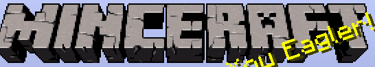

# Eaglercraft Chrome Extension

## Description
The Eaglercraft Chrome Extension is an extension for the Eaglercraft game that allows you to access the game directly from your Chrome browser.

Please note that this extension is currently in development and may not function as expected. It is intended for testing and development purposes.

## Installation
To install the Eaglercraft Chrome Extension, follow these steps:

1. Download or clone the repository to your local machine.
2. Ensure you have the Eaglercraft game client available.
3. Create a new folder and copy the downloaded files into it.
4. Rename the Eaglercraft game client to "eaglercraft" (without quotes).
5. Open your Chrome browser and go to the Extensions page.
6. Enable the "Developer mode" option.
7. Click on "Load unpacked" and select the folder where you copied the files.
8. The Eaglercraft Chrome Extension will be installed and ready to use.

## Contributing
Contributions to the Eaglercraft Chrome Extension are welcome! If you encounter any issues or would like to suggest improvements, please create an issue or submit a pull request on the GitHub repository.

## Disclaimer
The Eaglercraft Chrome Extension is not affiliated with the Eaglercraft game project. Nor is it Affliated with mojang, microsoft or any other entites controlling MINECRAFT It is an unofficial extension developed by Me.

